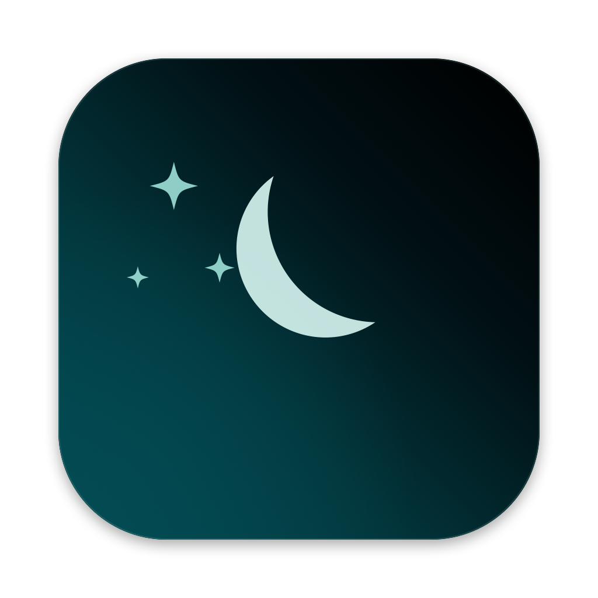

<div align="center">

<h1>No Distractions</h1>
<p>Covers the macOS desktop wallpaper. Leaves the icons alone.</p>
</div>

A menu-bar app that draws a calm gradient (or your own image) over the desktop
wallpaper, without hiding or disabling the desktop icons.

## Install

Download the latest `NoDistractions.zip` from
[Releases](../../releases/latest), unzip, and move **No Distractions.app** to
`/Applications`.

Current releases are **ad-hoc signed and not notarised**, so macOS quarantines
the download. Clear it once:

```sh
xattr -dr com.apple.quarantine "/Applications/No Distractions.app"
```

Then open the app. A moon appears in the menu bar; there is no Dock icon. To
start it at login, add it under System Settings → General → Login Items.

## Signing and notarisation

Only a Developer ID signature plus Apple notarisation makes a download open
with no warnings. Nothing else does: a self-signed certificate is not trusted by
Gatekeeper, and ad-hoc signing (`codesign -s -`) only satisfies local execution.
That needs the Apple Developer Program ($99/year).

The release workflow already implements the full path and switches itself on
when these repository secrets exist, so no code changes are needed later:

| Secret | What it is |
| --- | --- |
| `MACOS_CERTIFICATE_P12` | base64 of the exported *Developer ID Application* certificate (`.p12`) |
| `MACOS_CERTIFICATE_PASSWORD` | password used when exporting that `.p12` |
| `MACOS_SIGNING_IDENTITY` | e.g. `Developer ID Application: Your Name (TEAMID)` |
| `NOTARY_KEY_P8` | base64 of an App Store Connect API key (`AuthKey_XXXX.p8`) |
| `NOTARY_KEY_ID` | that key's ID |
| `NOTARY_ISSUER_ID` | issuer UUID from App Store Connect → Keys |

```sh
# Producing the two base64 blobs, once you have the files:
base64 -i DeveloperID.p12 | pbcopy
base64 -i AuthKey_ABCD1234.p8 | pbcopy
```

With them set, `scripts/bundle.sh` signs with the hardened runtime and a secure
timestamp (both mandatory for notarisation), then CI submits the zip to
`notarytool`, waits for the ticket, and staples it into the bundle so it
validates offline. Without them, CI emits a warning, publishes the ad-hoc build,
and swaps the release notes to the `xattr` instructions.

To sign a local build: `SIGN_IDENTITY="Developer ID Application: … (TEAMID)" sh scripts/bundle.sh`.

## How it works

macOS composites the desktop in a fixed stack. Measured on macOS 26:

| Layer | Owner | Role |
| --- | --- | --- |
| -2147483601 | Notification Center | desktop widgets |
| -2147483603 | Finder, WindowManager | **desktop icons** |
| **-2147483623** | No Distractions | **the overlay** |
| -2147483624 | Dock | wallpaper container |
| -2147483625 | Wallpaper | wallpaper renderer |
| -2147483626 | Window Server | display backstop |

`kCGDesktopWindowLevel` (-2147483623) is the one free slot: everything below it
is wallpaper machinery, and Finder's icon window sits twenty levels above. A
borderless, click-through window there hides the wallpaper and nothing else —
icons stay visible, selectable and right-clickable, and every normal window,
Stage Manager and Mission Control are unaffected.

Desktop widgets sit *above* the icons, so they can never be covered by this
approach. That is the hard ceiling on "cover the wallpaper but not the icons".

## Menu

- **Enable** — overlay on, or your real wallpaper. Unchecking keeps your
  selection, so re-enabling restores it.
- **Gradients ▸** — Aqua (default), Midnight, Graphite, Aurora, Dusk. Built from
  code: a multi-stop base plus one soft radial glow.
- **Images ▸** — remembered images, with **Add New Image…** last.
- **Settings ▸ Image Fit** — cover, contain, stretch, center.

## Command line

The same binary inside the bundle is a CLI that talks to the running app over a
Mach port:

```sh
alias nd='/Applications/No Distractions.app/Contents/MacOS/nodistractions'

nd set gradient aqua              # built-in preset
nd set gradient '#0b1020' '#4a2b6b' --angle 270
nd set color '#101014'
nd set image ~/Pictures/wall.jpg --fit cover
nd enable | nd disable | nd toggle
nd status                         # what is showing, and at which window level
nd wallpaper ~/Pictures/real.jpg  # set the real desktop picture instead
nd quit
```

`--fade <seconds>` controls the crossfade (default 0.35). Every command
validates input before it reaches the app, and fails loudly if the app is not
running.

State lives in `~/Library/Application Support/No Distractions/state.json`.

## Build from source

Requires macOS 14+ and a Swift 6 toolchain (Xcode 16 or its Command Line
Tools).

```sh
sh scripts/bundle.sh          # → dist/No Distractions.app (universal binary)
swift scripts/make-icon.swift # regenerate Resources/AppIcon.icns
swift build -c release        # CLI only
```

`scripts/bundle.sh` builds one slice per architecture and merges them with
`lipo`, because `swift build --arch arm64 --arch x86_64` requires full Xcode.

Tagging `v*` runs `.github/workflows/release.yml`, which builds the universal
bundle and attaches the zip plus its SHA-256 to a GitHub release.
